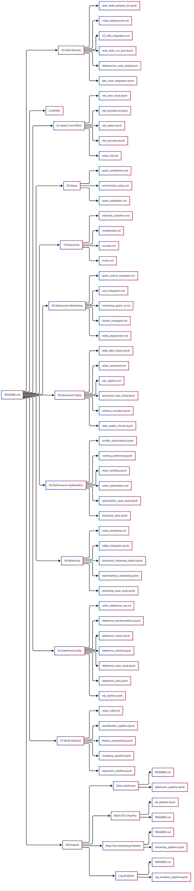

------

# 📘 Full README.md for `Spark-Theo`

# 🚀 Spark-Theo: Apache Spark Learning Roadmap (Data Engineering Focus)

Welcome to **Spark-Theo** — a structured roadmap and hands-on portfolio for mastering **Apache Spark** with a focus on **Data Engineering**.  
This repository contains **theory notes**, **practice notebooks**, and **end-to-end projects**, organized in a way to help you build Spark expertise step by step.  

---

## 🔥 What is Apache Spark?

Apache Spark is an **open-source distributed computing engine** designed for **big data processing** and **analytics**.  
It provides a unified platform for **batch processing, real-time streaming, machine learning, and graph analytics** — all at scale.  

Key features:
- In-memory distributed computing (much faster than Hadoop MapReduce)
- APIs in Python (PySpark), Scala, Java, R
- Modules: **Spark SQL, Spark Streaming, MLlib, GraphX**
- Handles structured, semi-structured, and unstructured data

---

## ❓ Why Spark?

- **Speed**: 100x faster than MapReduce for many workloads  
- **Scalability**: Runs on a single laptop or across thousands of cluster nodes  
- **Flexibility**: Supports batch ETL, streaming, ML, and graph processing  
- **Ecosystem Integration**: Works with Hadoop, Hive, Kafka, Cassandra, S3, Delta Lake, Kubernetes, etc.  
- **Industry Standard**: Widely used in Data Engineering, Data Science, and AI pipelines  

---

## 🕰 Short History of Spark

- **2009** → Spark was created at **UC Berkeley’s AMPLab** as a faster alternative to Hadoop MapReduce.  
- **2010** → Spark was open-sourced under a BSD license.  
- **2013** → Became an **Apache Software Foundation project**.  
- **2014+** → Exploded in popularity with Spark SQL, Streaming, MLlib, GraphX.  
- **Today** → Spark is the **#1 distributed data processing engine**, powering data pipelines at Netflix, Uber, Amazon, Alibaba, and many others.  

---

## 📂 Repository Structure

This repo is structured into **modules**, each covering a major Spark concept.  

Spark-Theo/
 │── 00-Setup/                  # Install Spark, setup environment, architecture notes
 │── 01-Spark-Core-RDDs/         # RDD fundamentals, transformations, actions
 │── 02-DataFrames-SQL/          # DataFrames API & Spark SQL queries
 │── 03-Data-Sources/            # Working with CSV, JSON, Parquet, JDBC, Hive, S3, HDFS
 │── 04-Streaming/               # Structured Streaming, Kafka integration
 │── 05-Performance-Optimization/ # Catalyst, Tungsten, partitioning, shuffles, caching
 │── 06-Advanced-Topics/         # Delta Lake, CDC, schema evolution, data quality
 │── 07-MLlib-(Optional)/        # Machine Learning pipelines in Spark
 │── 08-Deployment-Monitoring/   # spark-submit, cluster managers, Spark UI, CI/CD
 │── 09-Projects/                # End-to-end batch + streaming projects
 │── 10-Resources/               # Books, courses, cheatsheets, interview prep
 │── README.md                   # This file
 │── LICENSE

---

## 🛠 Learning Roadmap

### **1. Setup**
- Install Spark locally (PySpark / Jupyter)
- Understand Spark architecture (Driver, Executors, Cluster Managers)

### **2. Spark Core**
- RDDs (Resilient Distributed Datasets)
- Transformations vs Actions
- Caching & persistence

### **3. DataFrames & Spark SQL**
- Create DataFrames from files, RDDs, JDBC
- Filtering, grouping, joins
- Window functions
- Running SQL queries

### **4. Data Sources**
- CSV, JSON, Parquet, ORC, Avro
- Hive & JDBC connectors
- HDFS, S3, ADLS
- Delta Lake

### **5. Streaming**
- Structured Streaming
- Kafka ingestion
- Windowing & watermarking
- Writing to sinks (DB, Parquet, Kafka)

### **6. Performance Optimization**
- Catalyst Optimizer & Tungsten Engine
- Partitioning, bucketing
- Shuffle tuning
- Broadcast joins
- Handling data skew

### **7. Advanced Topics**
- Delta Lake / Iceberg / Hudi
- Schema evolution
- Change Data Capture (CDC)
- Data quality checks with Spark

### **8. MLlib (Optional)**
- Feature engineering
- Regression, classification, clustering
- Spark ML pipelines

### **9. Deployment & Monitoring**
- spark-submit & configs
- YARN, Kubernetes, Standalone
- Monitoring with Spark UI
- CI/CD for Spark jobs

### **10. Projects**
- **Batch ETL**: CSV → Parquet → Database  
- **Real-Time Streaming**: Kafka → Spark → Cassandra  
- **Data Lakehouse**: S3/ADLS + Delta Lake + Spark SQL  
- **Log Analytics**: Processing server/application logs  

---

## 📚 Resources

- **Books**: *Learning Spark* (O’Reilly), *High Performance Spark*  
- **Courses**: Databricks Academy, Spark on Coursera, free YouTube tutorials  
- **Cheatsheets**: PySpark & Spark SQL quick references  
- **Interview Prep**: Common Spark Data Engineering interview questions  

---

## ✅ Goal

By completing this repo, you will:  
- Understand **all major components** of Apache Spark  
- Build **real-world Data Engineering pipelines**  
- Create a **GitHub portfolio** showcasing Spark knowledge  
- Be ready for **Data Engineering interviews & projects**  

